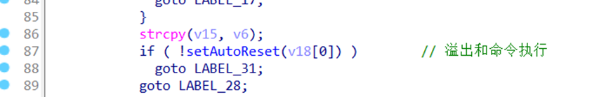
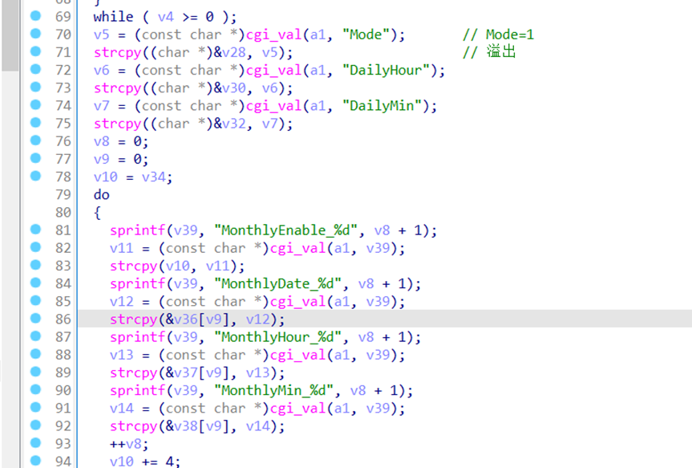
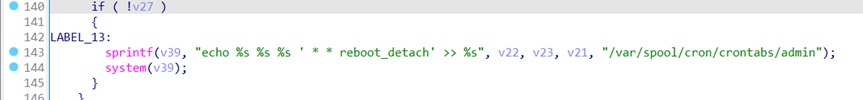

## 0、Vulnerability Introduction

```
Telesquare TLR-2005KSH has an unauthorized information leakage vulnerability
```

## 1、Affected version

```
The version mined this time is: TLR-2005KSH sw version 1.1.4
```

## 2、Vulnerability details

```
There is an unauthorized command execution vulnerability when requesting the admin.cgi parameter with setAutorest
```







## 3、Recurring vulnerabilities and POC

```
Due to legal and policy reasons, we are unable to provide the exploit for this vulnerability at this time.
```
